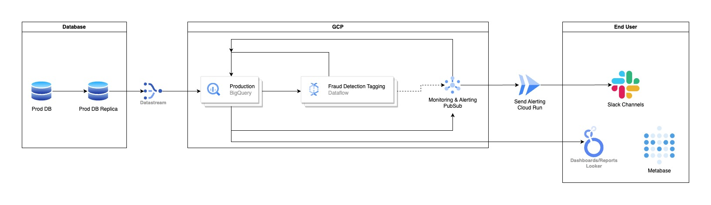

# take-home-test-flip-data-engineer

# 1. SQL Performance Optimization

## 1. a. Describe the potential inefficiencies in this query

Based on the query, it aims to retrieve top 100 upvoted answers provided by users from the website Stack Overflow, regarding topics related to Google PubSub. Despite the query provided the answer that the stakeholder is looking for, some parts of it need to be improved.

1. In the first CTE it returns all rows from all columns by using the `SELECT *` syntax. By returning all data, the resources it need to execute the query is really high and the cost is very expensive.

2. It uses LIKE syntax with wildcards. While this is simple to use, its not very efficient as it scans the whole value in the column, thus more costly in resource.

3. It sorts the returned data in the first CTE. This is considered as a premature optimization, as the result is sorted before we know that the data returned by the query is what we needed. The resource to sort the data is also high and costly.

4. The table `bigquery-public-data.stackoverflow.users` is joined plainly without creating a dedicated CTE. By doing this, we joined the full table to the first CTE, though what we needed from that table is only the 'display_name' column. As with the points above, the resource for this is also costly.

## 1. b. How could this query be optimized for performance and cost reduction without altering the outcome?

With some tweakings, the query can be improved:

1. Limit the number of returned data by selecting the necessary columns only.

Avoid using `SELECT *` and select only the columns that you need. For the table `bigquery-public-data.stackoverflow.comments`, we only need the columns text, score, and id. While for `bigquery-public-data.stackoverflow.users`, we only need id and display name.

2. Create CTEs for both tables

To improve the performance and cost, we can create 2 CTEs for both tables. This allows the BigQuery to execute the query in stages, reducing the cost and improving the performance. We can also add filters to both tables, such as partitioning columns, to reduce cost further.

3. Trade LIKE with REGEXP_CONTAINS syntax

Using LIKE with wildcards is not as efficient as using REGEXP_CONTAINS. REGEXP_CONTAINS scans only the strings that we have defined, not the whole string in the column.

```
WITH relevant_comments -- changing this to snake_case as opposed to CamelCase, just for preference
    AS (
  SELECT
    text
    ,score
    ,id
  FROM
    `bigquery-public-data.stackoverflow.comments`
  WHERE
    regexp_contains(text,'pubsub') is true
)
,users as (
  SELECT
    id
    ,display_name AS author_name
  FROM
    `bigquery-public-data.stackoverflow.users`
)

SELECT
  text
  ,score
  ,author_name
FROM
  relevant_comments c
JOIN
  users
  using(id)
LIMIT
  100
```

# 3. If you were to design a GCP stack that can detect this in real time, what is your approach?

Assuming we have the manpower and cost to run a Google Cloud Platform (GCP) stack for real-time fraud detection system:



1. **Change Data Capture (CDC) from RDBMS**:
   - Use services like Google Datastream to capture changes from the RDBMS mirror/replica, then store them in Google BigQuery

2. **Stream Processing and Aggregation**:
   - Once changes are captured in Google BigQuery, process them in real-time using a stream processing engine like Google Cloud Dataflow
   - Aggregate transaction data to identify patterns indicating potential fraud. This includes aggregating transactions per user, calculating balances, and counting the number of transactions within a specified time window (daily, weekly, monthly) depending on the needs

3. **Fraud Detection Rules**:
   - Implement rules based on your fraud detection criteria. For example:
     - Identify transactions that drain a user's e-wallet from 100% to 0% balance
     - Detect users who perform an unreasonable number of transactions within a short time frame (e.g., 300 transactions in 60 seconds)

4. **Alerting and Notifications**:
   - Once potential fraud is detected, trigger alerts using Google Cloud Pub/Sub or Google Cloud Monitoring
   - Send notifications via Slack, or other communication channels using services like Google Cloud Functions/Cloud Run

5. **Data Storage and Analysis**:
   - Store processed data and fraud detection results in Google BigQuery for further analysis and reporting. The data then can be visualized using Metabase or Looker, which then can be  automated to Slack or emails